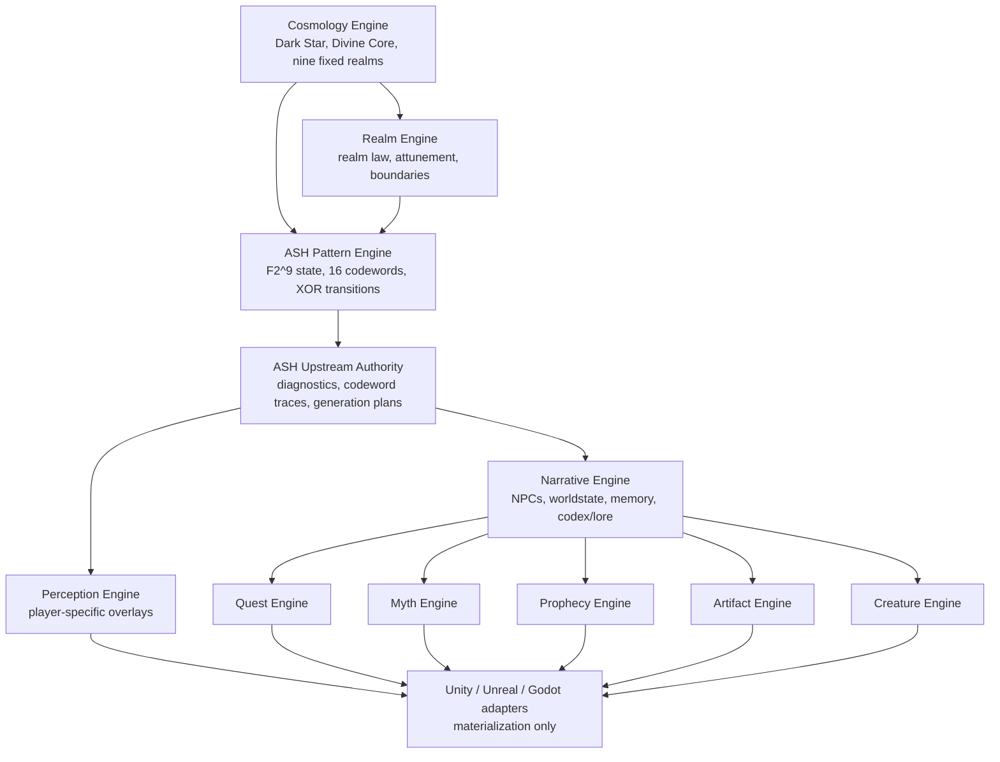
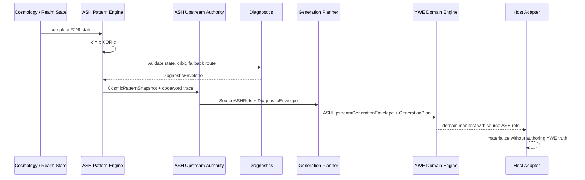

# Yggdrasil World Engine (YWE) v2.0.14

A cosmology-driven procedural narrative simulation engine built on the ASH Model of the Universe and governed by code-agnostic engine contracts.

---

## Current Authority Stack

The ASH Model of the Universe is the mathematical and ontological foundation of
Yggdrasil World Engine. Yggdrasil World Engine is an agnostic simulation
framework built on that model. The ASH Pattern System is a YWE component that
provides pattern integrity, diagnostics, recovery, containment, conformance,
code resilience, update safety, and patch stability. Where Ravens Wait: Eternal
Reckoning is the game and narrative layer built on the engine.

Mandatory source-truth statements:

- Yggdrasil World Engine is built on the ASH Model of the Universe.
- The ASH Model of the Universe is the mathematical and ontological foundation of the engine simulation layer.
- The ASH Pattern System is a YWE component for pattern integrity, diagnostics, recovery, containment, conformance, code resilience, update safety, and patch stability.
- Where Ravens Wait: Eternal Reckoning is the game and narrative layer.

The engine is a framework foundation, not a fixed setting bible. Designers may
define their own lore, gods, mythologies, factions, histories, and worlds on top
of the structural ontology.

Current authority contracts:

- `docs/architecture/ash_model_engine_cosmology_contract.md`
- `docs/architecture/ywe_cosmology_authority_contract.md`
- `docs/architecture/ash_pattern_system_component_contract.md`
- `docs/architecture/engine_vs_game_layer_contract.md`
- `docs/architecture/cosmology_framework_extensibility_contract.md`

Earlier repository language may use ASH Pattern System as shorthand for the
upstream mathematical layer. That shorthand is superseded by the current
authority stack above: the ASH Model of the Universe is the foundation, and the
ASH Pattern System is a YWE component.

---

## Overview

The Yggdrasil World Engine is a **code-agnostic cosmic narrative simulation engine** designed to generate:

- Infinite quests
- Mythologies
- Artifacts
- Creatures
- Civilizations
- Player mythic identities

All procedural systems derive from the **ASH Model of the Universe** through
ASH cosmic pattern state, diagnostics, generation plans, and YWE interpretation
contracts.

YWE functions as a **reality simulation layer**, not a rendering engine.
Rendering engines (Unity, Unreal, Godot) function as **host environments**.

The public reference wiki is available at:

[Yggdrasil World Engine Wiki](https://github.com/flynn33/yggdrasil-world-engine/wiki)

---

## Design Goals

- Infinite narrative generation
- Cosmology-consistent simulation
- Player-driven myth formation
- Modular engine architecture
- Engine-agnostic implementation
- Compatibility with RPG, MMO, and TTRPG

---

## Features

### Canonical 9-Realm Cosmology

The default nine realms are engine-level structural state layers and simulation
constants. They are not mandatory fictional map locations at the engine layer.
Where Ravens Wait: Eternal Reckoning may narratively express them as realms of
being, while other implementations may rename or reskin them if the structural
relationships remain stable.

1. Divine Core
2. Celestial
3. Causal
4. Mental
5. Astral
6. Etheric
7. Physical
8. Shadow
9. Void

### Infinite Quest Generation

Quests are not random templates. They are generated from ASH cosmic pattern state through pattern detection and player interpretation.

### Dynamic Myth Formation

Significant player events become mythology, influencing books, songs, cult beliefs, shrine inscriptions, future quests, and world rumors.

### Prophecy Generation

Prophecies generate future narrative attractors as probability weights, making related patterns more likely to emerge.

### Perception Layer

The world does not change -- player perception changes. The same location can be interpreted differently depending on realm attunement, wolf alignment, bloodline resonance, and narrative memory.

### Cosmic Pattern Engine

The ASH Model of the Universe is the mathematical and ontological foundation of
the engine simulation layer. The ASH Pattern System is a YWE component that
protects pattern integrity, diagnostics, recovery, containment, conformance,
code resilience, update safety, and patch stability. No subsystem may generate
meaningful content independently of ASH-derived state, diagnostics, codeword
traces, and generation plans.

### ASH/ASP Core Math Baseline

The active ASH/ASP math authority is the accepted
`YWE_ASP_CORE_MATH_REBUILD_PACKAGE` baseline. The ASH state space is `F2^9`:
512 complete 9-coordinate states, transformed only by the fixed 16 canonical
full-state codewords. State transitions use `x' = x XOR c`.

Meaningful YWE generation now carries `CosmicPatternSnapshot`,
`DiagnosticEnvelope`, and `GenerationPlan` provenance through the character,
creature, quest, NPC, artifact, myth, prophecy, perception, faction,
worldstate, codex/lore, and realm contracts. Host adapters may materialize from
those plans, but they must not author ASH truth or YWE domain truth.

### ASH Upstream Generation Authority

The historical upstream-generation contract remains as ASH Pattern System
component and packet-spine evidence, but the current repository authority stack
is defined by `docs/architecture/ywe_cosmology_authority_contract.md`.

```text
ASH Model of the Universe
  -> Yggdrasil World Engine
    -> ASH Pattern System component and YWE runtime systems
      -> YWE feature engines
        -> platform-specific runtime implementations
```

Player actions and exploration create YWE context packets and worldstate
deltas. YWE submits that context into ASH-governed generation, receives lawful
pattern structure, diagnostics, and generation plans, then interprets the output
into world, quest, NPC, creature, artifact, myth, prophecy, perception, faction,
progression, wolf, and ability manifests. Host adapters materialize approved
manifests but do not author symbolic truth.

---

## System Map



## Generation Flow



## Authority Boundary

| Surface | Owns | Must Not Own |
|---|---|---|
| ASH canonical specs | State space, codewords, transitions, diagnostics | Host rendering, game-engine implementation |
| ASH upstream authority | Lawful pattern generation, diagnostics, codeword traces, generation plans | YWE domain manifestation, host materialization |
| YWE core repo | Code-agnostic engines, schemas, lore, conformance, adapter contracts | ASH math, engine-specific runtime code |
| Forsetti governance | Module lifecycle, contracts, validation, policy enforcement | ASH math, YWE cosmology truth, codeword authority |
| Unity / Unreal / Godot adapters | Host materialization from `GenerationPlan` | ASH truth or YWE domain truth |

---

## Supported Host Engines

| Engine | Status |
|--------|--------|
| Unity | Planned |
| Unreal | Planned |
| Godot | Planned |

---

## Repository Structure

```
yggdrasil-world-engine/
  core/               -- Core engine specifications
    cosmology_engine/  -- Origin of gravity and reality
    realm_engine/      -- Fixed cosmological state management
    ash_pattern_engine/-- ASH pattern detection and generation
    narrative_engine/  -- Player-specific story transformation
    perception_engine/ -- Player perception and realm overlay

  modules/            -- Expansion engine specifications
    quest_engine/      -- Quest generation from cosmic patterns
    myth_engine/       -- Myth formation from significant events
    prophecy_engine/   -- Prophecy generation and tracking
    artifact_engine/   -- Artifact generation and management
    creature_engine/   -- Creature generation and behavior

  data/               -- Canonical schemas and registries
    realm_registry/    -- Nine canonical realms
    realm/             -- Realm-law and transition canonical rules
    module_capability/ -- Module capability schemas and applied manifests
    faction_topology/  -- Faction topology canonical schema surfaces
    pattern_archetypes/-- Pattern node schemas
    quest_archetypes/  -- Quest seed schemas
    myth_archetypes/   -- Myth record schemas
    bloodline_registry/-- Bloodline schemas
    perception/        -- Perception overlay canonical rules

  lore/               -- Cosmological lore and canon
    wrw_cosmology/     -- Creation and realm formation
    wolf_canon/        -- White Wolf and Dark Wolf canon
    bloodline_history/ -- Bloodline system lore

  adapters/           -- Host engine adapter specifications
    unity/
    unreal/
    godot/

  docs/               -- Documentation
    master_specification/
    architecture/
    ash_compliance/
```

---

## Getting Started

1. Clone this repository.
2. Review the master specification: `docs/master_specification/YWE_MASTER_SPECIFICATION.md`
3. Review the GitHub wiki: `https://github.com/flynn33/yggdrasil-world-engine/wiki`
4. Review the repository bootstrap baseline: `YWE_REPOSITORY_BOOTSTRAP_PROMPT.md`
5. Review the architecture documentation: `docs/architecture/`
6. Load data schemas and canonical rule artifacts into your host engine.
7. Implement core engines following interface definitions in `core/*/engine_interface.json`.
8. Extend with expansion modules following `modules/*/`.
9. Run `bash scripts/run_checks.sh` before proposing any repository change.

---

## Built on the Forsetti Framework (v0.1.0)

The Yggdrasil World Engine is built on the [Forsetti Framework](https://github.com/flynn33/Forsetti-Framework) -- an architecture governance framework that enforces module contracts, runtime policy, and structural integrity. The framework ensures that every module, contract, and integration follows a consistent set of rules.

Forsetti governs module lifecycle and activation policy. It does not override
the ASH/ASP core math baseline, YWE cosmology truth, canonical codeword set,
diagnostics, generation semantics, or package acceptance gates.

Forsetti governs the engine through **five design principles**:

1. **Native-first** -- Engine implementations use native idioms (C# for Unity, C++ for Unreal, GDScript for Godot)
2. **Contract-first** -- Interfaces are defined in `core/*/engine_interface.json` before any implementation begins
3. **Boundary-first** -- Engine architecture enforces strict one-way dependencies
4. **Policy-first** -- Modules declare capabilities; the host evaluates policy before activation
5. **Host-agnostic modules** -- The core specification is engine-agnostic; engine-specific code lives only in implementation branches

### Governance Files

| File | Description |
|------|-------------|
| [guide.md](guide.md) | Concise integration rules |
| [developer-guide.md](developer-guide.md) | Extended guide for engine implementors |
| [wiki.md](wiki.md) | Comprehensive reference and playbook |
| [docs/master_specification/YWE_MASTER_SPECIFICATION.md](docs/master_specification/YWE_MASTER_SPECIFICATION.md) | Foundational engine-first design baseline |
| [YWE_REPOSITORY_BOOTSTRAP_PROMPT.md](YWE_REPOSITORY_BOOTSTRAP_PROMPT.md) | Repository-structure baseline paired with the master spec |
| [missing_source_documents.md](missing_source_documents.md) | Canonical artifact inventory and pending placeholder tracking |
| [docs/architecture/authored_override_and_tooling_notes.md](docs/architecture/authored_override_and_tooling_notes.md) | Canonical authored override and tooling guardrail rules |
| [docs/architecture/realm_truth_boundary_contract.md](docs/architecture/realm_truth_boundary_contract.md) | Canonical boundary contract for realm truth vs interpretive layers |
| [agentic-coding-policy.json](agentic-coding-policy.json) | Machine-readable AI agent constraints |
| [yggdrasil-instructions.json](yggdrasil-instructions.json) | Machine-readable architecture rules |

### Canonical Rule Artifacts

| File | Description |
|------|-------------|
| [data/perception/perception_overlay_rules.yaml](data/perception/perception_overlay_rules.yaml) | Canonical perception overlay rules and truth-boundary constraints |
| [data/realm/realm_mechanics_rules.yaml](data/realm/realm_mechanics_rules.yaml) | Canonical realm-law rules for attunement, bleed, manifestation, and shifts |
| [data/realm/realm_boundary_profiles.yaml](data/realm/realm_boundary_profiles.yaml) | Canonical boundary profile catalog for lawful threshold behavior |
| [data/realm/realm_transition_examples.yaml](data/realm/realm_transition_examples.yaml) | Canonical lawful and unlawful transition examples |
| [data/module_capability/module_capability_manifest_schema.yaml](data/module_capability/module_capability_manifest_schema.yaml) | Canonical module capability and delegation-governance schema |
| `data/module_capability/manifests/*.yaml` | Applied canonical capability declarations for the current YWE core engines and feature modules |
| [data/faction_topology/faction_topology_state_schema.yaml](data/faction_topology/faction_topology_state_schema.yaml) | Canonical faction-topology state schema |

---

## ASH Rebuild Evidence

| File | Description |
|------|-------------|
| [specs/core/ash-state-space.pseudo.md](specs/core/ash-state-space.pseudo.md) | Canonical `F2^9` state-space specification |
| [specs/core/codeword-set.pseudo.md](specs/core/codeword-set.pseudo.md) | Fixed 16-codeword ASH transition set |
| [data/schemas/ash_generation_packet_schema.json](data/schemas/ash_generation_packet_schema.json) | Shared `CosmicPatternSnapshot`, `DiagnosticEnvelope`, and `GenerationPlan` packet schema |
| [docs/architecture/ash_upstream_authority_contract.md](docs/architecture/ash_upstream_authority_contract.md) | Canonical upstream mathematical and generative authority contract |
| [data/schemas/ash_upstream_generation_envelope_schema.json](data/schemas/ash_upstream_generation_envelope_schema.json) | Shared `ASHUpstreamGenerationEnvelope` provenance schema |
| [data/schemas/ywe_generation_context_packet_schema.json](data/schemas/ywe_generation_context_packet_schema.json) | Shared `YWEGenerationContextPacket` schema for player/world context |
| [data/schemas/ywe_interpretation_packet_schema.json](data/schemas/ywe_interpretation_packet_schema.json) | Shared `YWEInterpretationPacket` schema for feature-engine handoff |
| [data/validation/ash_generation_gate_contract.json](data/validation/ash_generation_gate_contract.json) | Required package gate contract for rebuilt generation systems |
| [data/validation/ash_upstream_authority_gate_contract.json](data/validation/ash_upstream_authority_gate_contract.json) | Dedicated upstream authority gate contract |
| [conformance/acceptance-judgment.md](conformance/acceptance-judgment.md) | Current conformance judgment for the code-agnostic repository scope |
| [.github/scripts/ywe_package_acceptance_check.py](.github/scripts/ywe_package_acceptance_check.py) | Blocking package acceptance test runner |

---

## ASH Compliance

All procedural systems must derive from ASH Pattern Detection. No subsystem may become an independent random generator detached from the cosmic state.

See `docs/ash_compliance/` for the full compliance rules and checklist.

---

## License

Proprietary. All rights reserved. Copyright Jim Daley.

See [LICENSE](LICENSE) for full terms.
