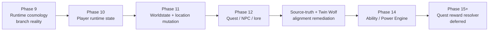

# Architecture Documentation

## Engine-First Architecture

The Yggdrasil World Engine is organized as an engine-first architecture. The ASH Model of the Universe is the mathematical and ontological foundation for YWE and its systems; YWE interprets and manifests that foundation through code-agnostic engine contracts. The ASH Pattern System is a YWE component that protects diagnostics, pattern integrity, recovery, containment, resilience, conformance, code resilience, update safety, and patch stability.

Required first-read authority contracts:

- `ash_model_engine_cosmology_contract.md` -- ASH Model of the Universe as the mathematical and ontological engine foundation.
- `ywe_cosmology_authority_contract.md` -- Current game/engine/foundation/component authority stack.
- `ash_pattern_system_component_contract.md` -- ASH Pattern System role inside YWE.
- `engine_vs_game_layer_contract.md` -- YWE engine layer and Where Ravens Wait game/narrative layer separation.
- `cosmology_framework_extensibility_contract.md` -- Engine cosmology as structural framework, not fixed setting bible.
- `ash_upstream_authority_contract.md` -- Historical packet-spine authority contract, preserved as superseded component evidence where necessary.

Source-truth and Twin Wolf remediation contracts:

- `twin_wolf_companion_canon_contract.md` -- White Wolf and Dark Wolf as complementary non-moral embodied companions.
- `dual_variable_alignment_model_contract.md` -- Non-moral dual-variable alignment where both variables can grow through the same event.
- `lineage_resonance_model_contract.md` -- Simulation-level lineage resonance propagation without destiny locks.

Phase 9 runtime-cosmology foundation contracts:

- `runtime_cosmology_foundation_contract.md` -- Phase 9 foundation flow for base world ontology, branch events, diagnostics, and manifestation boundaries.
- `base_world_ontology_contract.md` -- Nine-plane substrate rules; planes are base ontology, not generated branch realities.
- `leaf_branch_reality_contract.md` -- Runtime-generated player branch reality rules and divergence boundaries.
- `branch_event_contract.md` -- Meaningful player-choice event contract for branch creation and bias updates.
- `existential_gameplay_kernel_contract.md` -- A1-A6 diagnostics and existence potential evaluation.
- `pattern_vector_runtime_contract.md` -- Runtime semantics for H, K, D, S, and L pattern vector components.

Phase 10 player runtime state contracts:

- `player_runtime_state_contract.md` -- Persistent player state spine for branch, identity, resonance, memory, world links, and ASH Pattern System resilience references.
- `player_agent_state_contract.md` -- Player agent state reference contract for branch-bound agency and current runtime context.
- `celestial_identity_progression_contract.md` -- Veiled identity and reveal-through-play progression rules.
- `plane_attunement_runtime_contract.md` -- Dynamic plane attunement pressure contract.
- `bloodline_resonance_runtime_contract.md` -- Dynamic bloodline resonance pressure contract.
- `player_memory_and_action_trace_contract.md` -- Player memory, action trace, and provenance reference contract.
- `player_state_branch_integration_contract.md` -- Leaf branch reality and branch event integration rules.
- `player_state_asp_resilience_contract.md` -- ASH Pattern System component diagnostics, recovery, containment, conformance, resilience, and patch/update stability rules.

Phase 11 worldstate and location mutation contracts:

- `worldstate_delta_contract.md` -- WorldstateDeltaPacket and DiagnosticNoOp rule for meaningful consequences.
- `location_state_resolver_contract.md` -- Location resolution inputs and outputs for revisits, branch overlays, diagnostics, and future bias.
- `location_branch_overlay_contract.md` -- Player-specific leaf branch location overlays that do not rewrite base ontology.
- `location_mutation_rule_contract.md` -- Mutation trigger, provenance, forbidden effect, fallback, and output-packet rules.
- `future_generation_bias_contract.md` -- Eligibility and weighting bias rules for later systems without direct content materialization.
- `shared_truth_vs_branch_truth_contract.md` -- Boundary among base world truth, shared truth, leaf branch truth, perception, myth, prophecy, faction claim, and host materialization.
- `consequence_classification_contract.md` -- Auditable consequence classes for worldstate deltas.
- `worldstate_location_integration_map.md` -- Phase 8-10 inputs, Phase 11 records, and Phase 12+ consumers.
- `worldstate_location_mutation_v1.md` -- Earlier Phase 11-adjacent packet-spine contract retained for compatibility and historical validation.

Phase 12 quest, NPC, and lore generation contract:

- `quest_npc_lore_generation_v1.md` -- Canonical quest-chain, NPC-manifest, NPC-memory, codex-lore, myth-record, and social-distribution generation boundary rules.
- `quest_generation_from_axioms_contract.md` -- Quest candidate generation from axiom pressure, existence potential, branch reality, player state, location state, and worldstate consequences.
- `npc_generation_from_branch_context_contract.md` -- NPC candidate generation from branch, player, location, relation, and axiom context.
- `lore_generation_from_pattern_trace_contract.md` -- Lore fragment generation from pattern trace, source context, truth scope, and visibility rules.
- `existential_content_generation_integration_map.md` -- Phase 9-11 inputs, Phase 12 content-generation records, and Phase 13+ consumers.
- `quest_npc_lore_truth_boundary_contract.md` -- Truth-scope boundaries for generated quests, NPC claims, lore fragments, myth, prophecy, and faction claims.
- `quest_npc_lore_manifest_provenance_contract.md` -- Shared provenance spine for generated content candidates and downstream handoff.
- `content_generation_acceptance_contract.md` -- Acceptance and rejection conditions for generated content candidates.
- `axiom_to_content_pressure_map.md` -- A1-A6 pressure mapping into quest, NPC, and lore generation surfaces.

Phase 14 ability and power engine contracts:

- `ability_power_engine_contract.md` -- Ability emergence, unlock, stabilization, transformation, decoherence, and consequence boundary.
- `ability_unlock_pressure_contract.md` -- Unlock pressure from branch history, worldstate consequences, lineage, plane attunement, wolf state, artifacts, myth, and prophecy exposure.
- `ability_source_model_contract.md` -- Required source provenance for every meaningful ability.
- `ability_state_progression_contract.md` -- Ability state progression, recoverable decoherence, and state update packet boundaries.
- `ability_manifestation_contract.md` -- Manifestation modes and safe runtime handoff rules.
- `ability_consequence_integration_contract.md` -- AbilityConsequencePacket requirements for meaningful use.
- `ability_wolf_companion_integration_contract.md` -- Wolf-linked ability integration while preserving embodied companion canon.
- `ability_combat_and_quest_use_contract.md` -- Combat and quest-use surfaces without platform runtime implementation.
- `ability_branch_reality_integration_contract.md` -- Leaf-branch influence rules for abilities.
- `ability_lineage_and_plane_integration_contract.md` -- Lineage, bloodline, and plane-attunement ability links.
- `ability_artifact_myth_prophecy_integration_contract.md` -- Artifact binding, myth participation, and prophecy pressure links.
- `ability_safety_and_decoherence_contract.md` -- Safety, recovery, and decoherence handling.
- `ability_engine_integration_map.md` -- Phase 10-12 inputs, Phase 14 records, and Phase 15 handoff packets.

The current controlling authority chain is:

```text
ASH Model of the Universe
  -> Yggdrasil World Engine
    -> ASH Pattern System component and YWE runtime systems
      -> YWE feature engines
        -> platform-specific runtime implementations
```

Earlier language that treated ASH Pattern System as the topmost authority is
superseded by `ywe_cosmology_authority_contract.md`.

Historical acceptance-marker note: earlier docs said "ASH defines upstream mathematical and generative authority." That marker is retained here only as superseded legacy wording for validator compatibility; current authority is defined by the ASH Model of the Universe foundation and the ASH Pattern System component role above.

## Repository Baseline Authority

Before applying downstream architecture guidance, keep the original repository
baseline in view:

- `../master_specification/YWE_MASTER_SPECIFICATION.md` -- foundational engine-first design and canonical cosmology baseline
- `../../YWE_REPOSITORY_BOOTSTRAP_PROMPT.md` -- repository structure and scaffolding baseline paired with the master specification

## Core Engines

| Engine | Purpose |
|--------|---------|
| Cosmology Engine | Structural cosmology state and default realm-layer constants |
| Realm Engine | Cosmological state-layer management and player attunement |
| ASH Pattern Engine | ASH-derived state, diagnostics, codeword traces, and generation planning |
| Narrative Engine | Player-specific interpretation, story transformation, and memory |
| Perception Engine | Player perception overlay based on cosmic state |

## Expansion Engines (Modules)

| Module | Purpose |
|--------|---------|
| Quest Engine | Quest generation from cosmic patterns |
| Myth Engine | Myth formation from significant events |
| Prophecy Engine | Future narrative attractors and probability weights |
| Artifact Engine | Artifact generation and management |
| Creature Engine | Creature generation and behavior |

## Future Expansion Engines

The architecture supports additional engines:
- Civilization Engine
- Economy Engine
- Religion Engine
- Faction Engine
- Politics Engine

All expansion engines must consume ASH-derived pattern output through YWE
interpretation contracts. No module may generate meaningful content
independently.

## Control Documents

- `ash_upstream_authority_contract.md` -- Historical packet-spine authority contract retained for provenance rules under the current authority stack
- `ywe_cosmology_authority_contract.md` -- Current authority stack contract for the game layer, YWE, ASH Model of the Universe, and ASH Pattern System component
- `ash_pattern_system_component_contract.md` -- Component contract for ASH Pattern System diagnostics, recovery, containment, conformance, resilience, and patch/update stability
- `ash_downstream_contract.md` -- Downstream consumption contract subordinate to the upstream authority contract
- `authored_override_and_tooling_notes.md` -- Canonical authored override authority order, allowed/forbidden override categories, and tooling guardrails
- `realm_truth_boundary_contract.md` -- Canonical separation contract for realm truth, perception, myth, prophecy, faction claims, and authored overrides

## Canonical Data Companions

- `../../data/perception/perception_overlay_rules.yaml` -- Perception-layer truth-boundary rules
- `../../data/realm/realm_mechanics_rules.yaml` -- Realm-law and attunement rules
- `../../data/realm/realm_boundary_profiles.yaml` -- Boundary profile catalog for lawful threshold behavior
- `../../data/realm/realm_transition_examples.yaml` -- Lawful and unlawful transition examples
- `../../data/module_capability/module_capability_manifest_schema.yaml` -- Module capability, delegation, and suppression governance schema
- `../../data/module_capability/manifests/*.yaml` -- Applied canonical capability declarations for current YWE engines and modules
- `../../data/faction_topology/faction_topology_state_schema.yaml` -- Faction topology state schema

## Dependency Direction

All modules consume ASH Model of the Universe-derived meaning through YWE
contracts and may use ASH Pattern System diagnostics, codeword traces,
generation plans, and YWE interpretation packets for stability. The dependency
flow is:

```
ASH Model of the Universe
  -> Yggdrasil World Engine
    -> ASH Pattern System component and core runtime services
      -> Feature manifestation services
        -> host adapters
```

No reverse dependencies. No circular dependencies.

Host adapters materialize approved manifests but do not author symbolic truth.

## Phase Contract Pipeline



The Phase 14 Ability / Power Engine consumes the accepted Phase 9-12 surfaces
and the source-truth/Twin Wolf remediation gate. It does not imply a completed
Phase 13 feature package; Phase 13 remains deferred until separately accepted.

Phase 9 branch-reality dependency flow:

```text
ASH Model of the Universe
  -> YWE Runtime Cosmology Contracts
    -> Branch Reality Resolver
      -> Feature Engines

ASH Pattern System Component
  -> diagnostics, conformance, recovery, and containment support
```

Phase 10 player-runtime dependency flow:

```text
Leaf Branch Reality
  -> Player Runtime State
    -> PlayerStateUpdatePacket
      -> YWE generation context references
        -> ASH Model of the Universe-grounded generation
          -> ASH Pattern System diagnostics and resilience support
```

Phase 11 worldstate-location dependency flow:

```text
Player Runtime State
  -> WorldstateDeltaPacket
    -> LocationStateRecord / LocationBranchOverlay / LocationMutationRule
      -> FutureGenerationBiasUpdate
        -> YWEGenerationContextPacket
```

Phase 12 quest-NPC-lore dependency flow:

```text
WorldstateDeltaPacket + FutureGenerationBiasUpdate
  -> YWEGenerationContextPacket
    -> QuestChainManifest / NPCManifest / CodexRecord / MythRecord
      -> QuestResolutionPayload / NPCMemoryDelta / SocialDistributionDelta
        -> WorldstateDeltaPacket or DiagnosticNoOp
```
