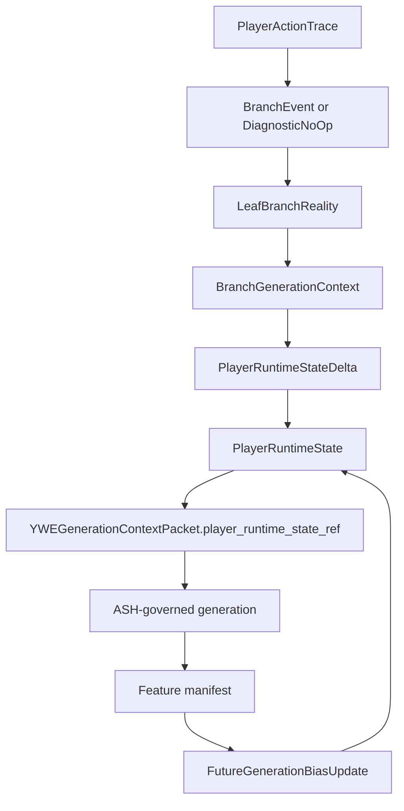

# Player Runtime State v1

Date: 2026-05-17
Project: Yggdrasil World Engine
Status: canonical Phase 10 runtime-state contract

Phase 8-9 Boundary: DEFERRED - Phase 9 boundary violation; do not consume until the matching owner-approved package is accepted.

## Purpose

Player Runtime State v1 defines the canonical YWE record for player-specific
runtime truth. It joins identity phase, memory, realm attunement, wolf
resonance, bloodline resonance, perception posture, branch reality references,
worldstate consequence references, future generation bias, and ASH-derived
provenance into one stable contract.

This contract defines the target referenced by
`YWEGenerationContextPacket.player_runtime_state_ref`. It may influence
generation context, branch generation context, and later feature-engine
eligibility. It must not mutate ASH math, rewrite shared world truth, change
the base nine-plane ontology, or allow host adapters to author player truth.

## Authority Position

```text
ASH Cosmological Model
  -> Yggdrasil World Engine
    -> YWE Runtime Cosmology Contracts
      -> Leaf Branch Reality
        -> Player Runtime State
          -> YWEGenerationContextPacket
            -> Feature-engine manifests
              -> Host adapter materialization
```

ASH Pattern System remains a YWE component for diagnostics, pattern integrity,
recovery, containment, conformance, code resilience, and update/patch stability
throughout this flow.

## Canonical Files

| File | Role |
|---|---|
| `data/schemas/player_runtime_state_schema.json` | JSON Schema for `PlayerRuntimeState` and `PlayerRuntimeStateDelta` |
| `core/narrative_engine/player_runtime_state_rules.yaml` | Runtime rules, phase model, mutation policy, and validation markers |
| `data/validation/player_runtime_state_gate_contract.json` | Validation contract for Phase 10 completeness |
| `scripts/check_player_runtime_state.py` | Local and CI validation gate |

## State Layers

| Layer | Core Fields | Owner | Boundary |
|---|---|---|---|
| Identity core | `origin`, `celestial_memory`, `current_phase`, `awakening_fragments` | Narrative Engine | Identity is revealed through play, never fixed as static destiny |
| Resonance channels | `realm_attunement`, `wolf_resonance`, `bloodline_resonance` | Narrative Engine with Realm Engine inputs | Resonance changes access, pressure, and interpretation, not fixed cosmology |
| Branch context | `current_leaf_branch_ref`, `branch_generation_context_refs`, `branch_event_refs` | Runtime Cosmology Contracts and Narrative Engine | Player state records branch participation; it does not pre-generate branch trees |
| Continuity references | `narrative_memory_refs`, `unresolved_tension_refs`, `active_worldstate_delta_refs`, `future_generation_bias_refs` | Narrative Engine | Consequence persists through references and is not presentation-owned |
| Perception posture | `perception_state_ref`, `active_realm_form` | Perception Engine with Realm Engine inputs | Perception may diverge per player but must not rewrite shared truth |
| Generation provenance | `cosmic_pattern_snapshot_ref`, `diagnostic_ref`, `generation_plan_ref`, `source_ash_refs`, `axiom_diagnostic_refs`, `pattern_vector_refs`, `existence_potential_ref` | ASH Pattern System component and YWE contracts | Meaningful updates remain ASH-derived and diagnostic-backed |

## Runtime Workflow



The state is cyclical, but not self-authoring. A runtime state update must be
anchored in an accepted trace, a branch event or diagnostic no-op, a
worldstate delta, and ASH-derived provenance.

## Player Origin Phase Model

| Phase | Meaning | Typical Signals |
|---|---|---|
| `mortal_unknowing` | The player begins as mortal with celestial memory veiled | Mundane identity pressure, low-salience realm hints, hidden bloodline echo |
| `first_stirrings` | Repeated patterns begin to create phase-aware pressure | Symbolic echo, realm resonance spike, wolf resonance prompt |
| `memory_recovery` | Play-supported fragments become explicit but incomplete memory | Awakening fragment, bloodline resonance confirmation, realm threshold context |
| `identity_conflict` | Competing interpretations of the player's origin become active | Contested fragment, faction claim pressure, mythic identity counterclaim |
| `chosen_becoming` | Consequential choices integrate the player's identity | Integrated fragment, chosen alignment consequence, irreversible progression delta |
| `world_actor` | The player's identity has world-visible consequence | Myth eligibility, prophecy visibility, faction topology reaction |

Phase is descriptive, not destiny. A phase can bias future generation context,
but it cannot force a fixed future or bypass player choice.

## Update Rules

1. Runtime state begins with `origin = mortal` and `celestial_memory = veiled`.
2. Meaningful changes require `PlayerRuntimeStateDelta`.
3. Every accepted delta must carry `diagnostic_ref`, `generation_plan_ref`, and
   `source_ash_refs`.
4. Branch-related updates must reference `BranchEvent`, `LeafBranchReality`, or
   `BranchGenerationContext` evidence.
5. A delta may be rejected as `DiagnosticNoOp` when evidence or provenance is
   insufficient.
6. Realm attunement may change access, overlay, pressure, and interpretation,
   but not the fixed realm structure.
7. White Wolf and Dark Wolf values are complementary pressure channels, not a
   good/evil axis.
8. Narrative memory and unresolved tension references are append-first;
   destructive removal requires an explicit delta reason.
9. Host adapters may round-trip stored runtime state but may not author new
   runtime truth.
10. Runtime state can influence later generation context only through
    `YWEGenerationContextPacket`.

## Ownership Matrix

| Mutation Source | Allowed Scope | Rejected Scope |
|---|---|---|
| Narrative Engine | Identity phase, memory refs, unresolved tension refs, runtime deltas | ASH math, fixed realm ontology |
| Runtime Cosmology Contracts | Branch refs, branch-generation context refs, branch event refs | Rejected: pre-generated branch trees or base ontology mutation |
| Realm Engine | Realm-law context, threshold eligibility, active realm-form support | Player destiny, narrative memory |
| Perception Engine | Player-specific overlay refs and perception persistence refs | Shared world truth rewrites |
| Quest Engine | Quest resolution refs and approved consequence payloads | Direct player-state writes without a delta |
| Host adapter | Presentation, persistence round-trip, materialization | Canonical runtime-state authorship |

## Rejection Cases

These are hard failures for a conforming implementation:

- Player Runtime State attempts to mutate ASH math.
- A runtime-state delta attempts to change the base nine-plane ontology.
- Player Runtime State creates a leaf branch without branch event or diagnostic evidence.
- A host adapter directly writes canonical player state.
- A perception update rewrites shared world truth.
- A quest reward sets fixed identity destiny without play-supported evidence.
- A runtime delta lacks `diagnostic_ref`, `generation_plan_ref`, or `source_ash_refs`.
- White Wolf or Dark Wolf pressure is treated as a good/evil axis.

## Validation

Run:

```bash
python3 scripts/check_player_runtime_state.py
bash scripts/run_checks.sh
```

The dedicated gate checks required files, required markers, schema definitions,
runtime-state required fields, provenance fields, branch-reality references,
packet-spine references, and forbidden current-truth claims.
