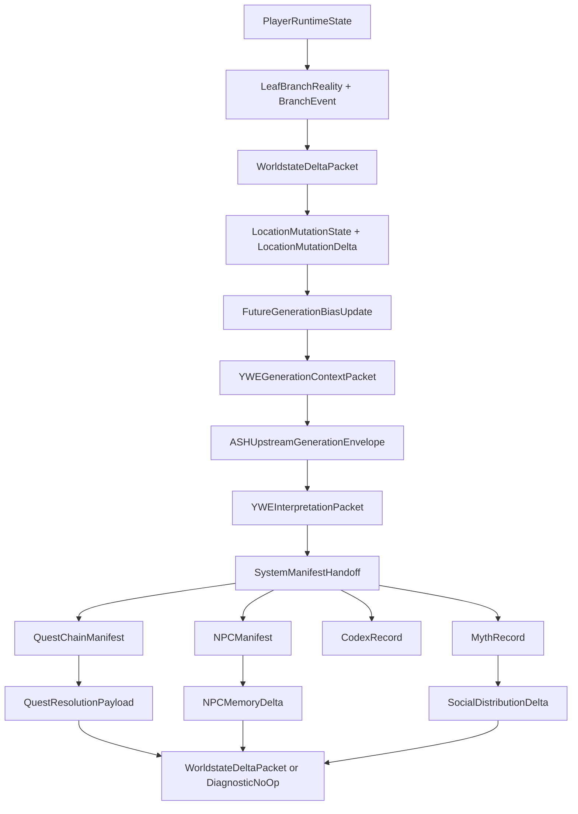
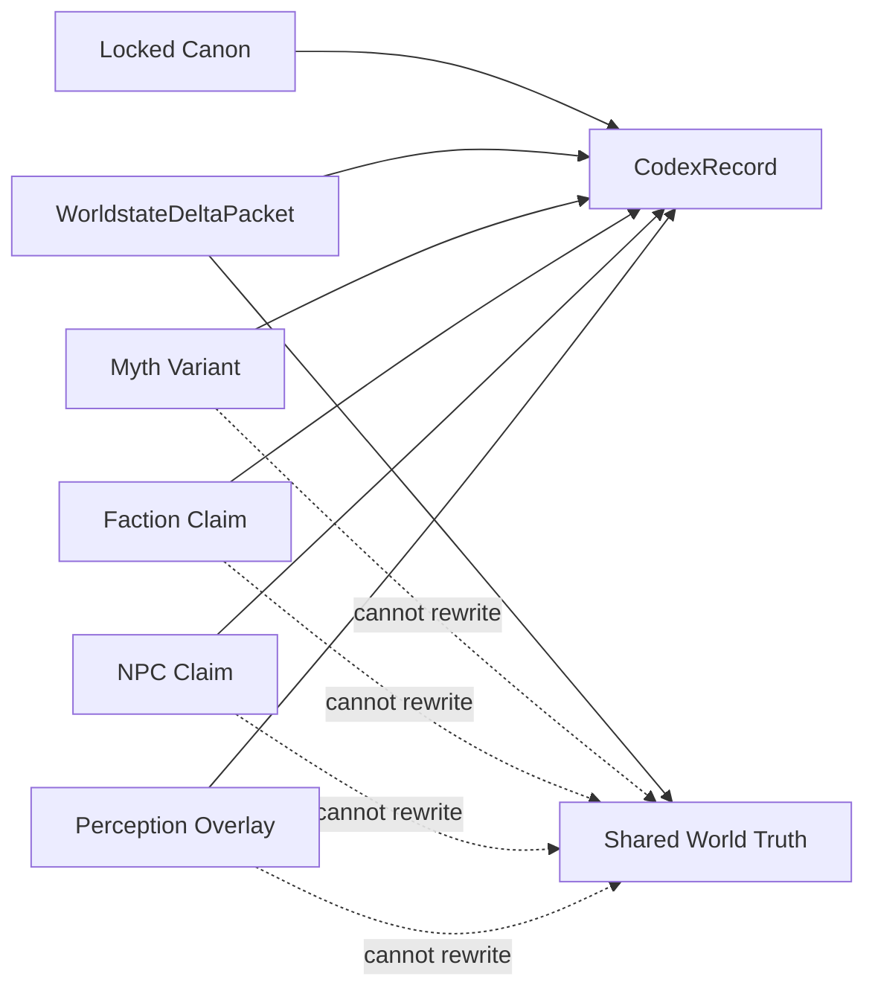

# Quest, NPC, and Lore Generation v1

Date: 2026-05-17
Project: Yggdrasil World Engine
Status: canonical Phase 12 quest, NPC, and lore generation contract

Phase 12 Status: active package authority after Phase 11 acceptance.

## Purpose

Quest, NPC, and Lore Generation v1 defines the canonical YWE contract for
ASH-derived quest chains, NPC manifests, NPC memory deltas, codex lore records,
myth records, and social distribution deltas. It sits downstream of Phase 10
`PlayerRuntimeState` and Phase 11 `WorldstateDeltaPacket`,
`LocationMutationState`, `LocationMutationDelta`, and
`FutureGenerationBiasUpdate`.

This phase promotes existing quest, NPC, myth, and codex placeholders into a
single auditable generation surface. It does not implement companion behavior,
abilities, reward resolution, save/load adapters, platform runtime code, or the
Ravenfall Gate vertical slice.

## Authority Position

```text
ASH Cosmological Model
  -> Yggdrasil World Engine
    -> YWE Runtime Cosmology Contracts
      -> Leaf Branch Reality
        -> Player Runtime State
          -> Worldstate and Location Mutation
            -> Quest, NPC, and Lore Generation
              -> FutureGenerationBiasUpdate
                -> YWEGenerationContextPacket
```

ASH Pattern System remains a YWE component for diagnostics, pattern integrity,
recovery, containment, conformance, code resilience, and update/patch stability
throughout this flow.

## Canonical Files

| File | Role |
|---|---|
| `data/schemas/quest_npc_lore_generation_schema.json` | JSON Schema for Phase 12 quest, NPC, lore, myth, and social distribution records |
| `core/narrative_engine/quest_npc_lore_generation_rules.yaml` | Runtime rules, pipeline, rejection cases, and validation markers |
| `data/validation/quest_npc_lore_generation_gate_contract.json` | Validation contract for Phase 12 completeness |
| `scripts/check_quest_npc_lore_generation.py` | Local and CI validation gate |
| `examples/quest_npc_lore_generation/*.example.json` | Concrete Ravenfall Gate examples tied to Phase 10 and Phase 11 records |

## Record Families

| Family | Core Records | Owner | Boundary |
|---|---|---|---|
| Quest generation | `QuestGenerationRequest`, `QuestChainManifest`, `StageManifest`, `CompletionModeSet`, `QuestResolutionPayload` | Quest Engine with Narrative Engine context | Quests are ASH-derived interpretive containers and must expose at least two completion modes |
| NPC generation | `NPCManifest`, `RelationshipVector`, `TruthFunction`, `PersistenceState`, `NPCMemoryDelta` | Narrative Engine NPC synthesis | NPC beliefs and claims are interpretive unless backed by accepted worldstate |
| Lore generation | `CodexRecord`, `LoreRecordVariant`, `VisibilityScope` | Narrative Engine codex/lore layer | Lore may record layers but may not overwrite locked canon or endgame truth protection |
| Myth generation | `MythSeedCandidate`, `MythRecord`, `MythLine`, `SocialDistributionDelta` | Myth Engine | Myth is retrospective social interpretation and may not rewrite factual world truth |

## Runtime Workflow



The workflow is append-first. Quest resolution, NPC memory changes, lore
visibility, and myth distribution may influence later generation context, but
they must do so through worldstate deltas, diagnostic no-ops, location mutation
records, or future-generation bias updates.

## Truth-Layer Rules



Generated lore can reference locked canon but cannot overwrite it. Myths,
faction claims, NPC claims, and perception overlays may create variants for
audience and progression, but they do not become shared factual substrate
without a committed `WorldstateDeltaPacket`.

## Completion Modes

Every `QuestChainManifest` must include a `CompletionModeSet` with
`minimum_mode_count >= 2`. A context may make one route more likely, costly, or
available, but the manifest contract cannot collapse into a single scripted
outcome.

Allowed completion mode kinds:

- `reveal`
- `conceal`
- `contain`
- `reconcile`
- `sacrifice`
- `defer`

## NPC Claim Boundaries

| Claim Boundary | Meaning | Promotion Rule |
|---|---|---|
| `npc_claim_only` | Known or believed by the NPC | May influence dialogue, memory, and social pressure only |
| `faction_claim_only` | Held by faction context | May influence faction reactions and myth variants only |
| `branch_local_claim` | True only in the active leaf branch | Requires `current_leaf_branch_ref` and cannot escape branch scope silently |
| `worldstate_backed_fact` | Backed by accepted worldstate | Requires `worldstate_delta_packet_ref` |

## Update Rules

1. Phase 12 generation starts from `QuestGenerationRequest` or an equivalent
   `YWEGenerationContextPacket` trigger.
2. Accepted records must carry `source_ash_refs`, `diagnostic_ref`,
   `generation_plan_ref`, `ywe_generation_context_packet_ref`, and
   `worldstate_delta_refs`.
3. Quest chains require `CompletionModeSet.minimum_mode_count >= 2`.
4. Quest resolution emits or references `WorldstateDeltaPacket`,
   `LocationMutationDelta`, and `FutureGenerationBiasUpdate`.
5. NPC memory changes require `NPCMemoryDelta` and remain append-only.
6. NPC and faction claims are claims, not ontology.
7. Codex records must preserve layer and visibility scope.
8. Myth records are retrospective interpretations of consequences and cannot
   rewrite factual world truth.
9. Host adapters materialize approved manifests and cannot author Phase 12
   truth records.

## Rejection Cases

These are hard failures for a conforming implementation:

- A quest manifest lacks ASH provenance.
- A quest manifest has fewer than two completion modes.
- An NPC manifest lacks `TruthFunction` or `PersistenceState`.
- An NPC memory delta lacks a source resolution payload.
- An NPC, faction, myth, or perception claim is promoted to shared truth
  without `WorldstateDeltaPacket`.
- A codex record overwrites locked canon.
- A myth record rewrites factual world truth.
- A social distribution delta lacks worldstate evidence.
- A host adapter authors quest, NPC, lore, myth, or social truth.

## Validation

Run:

```bash
python3 scripts/check_quest_npc_lore_generation.py
bash scripts/run_checks.sh
```

The dedicated gate checks required files, schema records, required fields,
authority-boundary constants, packet-spine registration, context triggers,
examples, completion-mode minima, promoted placeholder contracts, and forbidden
truth-rewrite claims.
