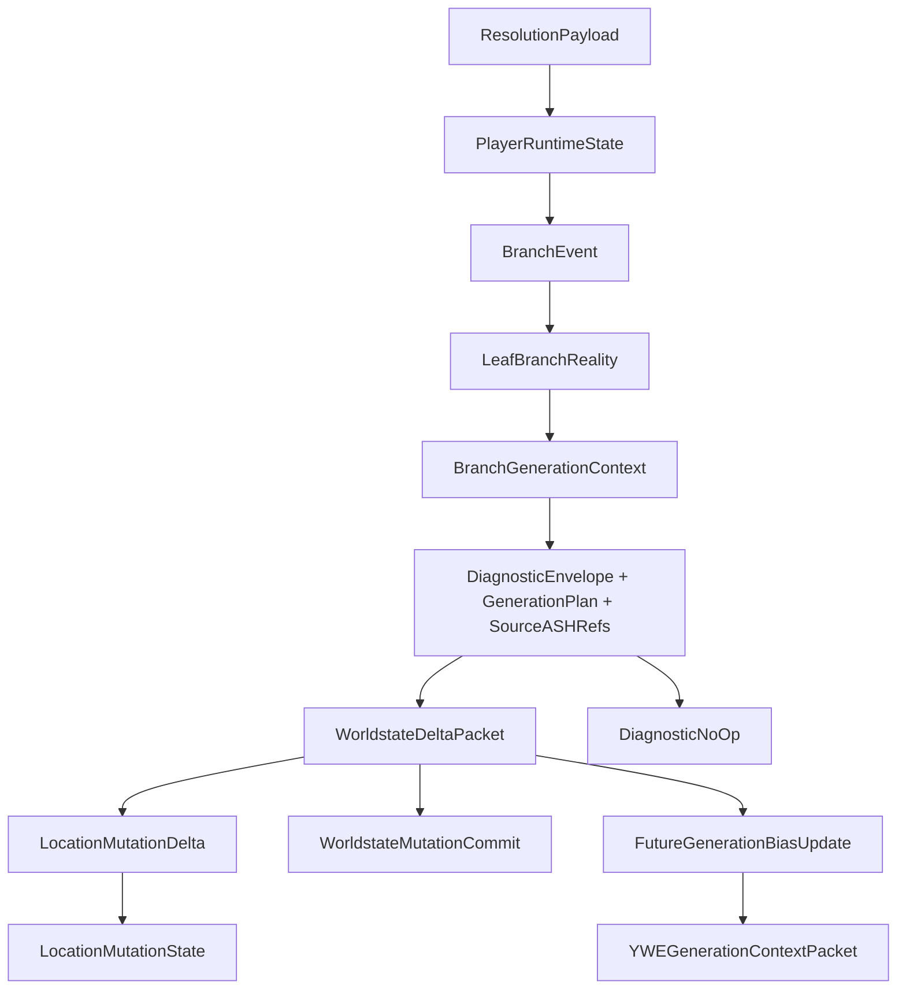

# Worldstate and Location Mutation v1

Date: 2026-05-17
Project: Yggdrasil World Engine
Status: canonical Phase 11 worldstate and location mutation contract

Phase 8-9 Boundary: DEFERRED - Phase 9 boundary violation; do not consume until the matching owner-approved package is accepted.

## Purpose

Worldstate and Location Mutation v1 defines the canonical YWE contract for
persistent consequence after meaningful resolution. It connects
`PlayerRuntimeState`, `BranchEvent`, `LeafBranchReality`,
`BranchGenerationContext`, `WorldstateDeltaPacket`, `LocationMutationState`,
`LocationMutationDelta`, `WorldstateMutationCommit`, `DiagnosticNoOp`, and
`FutureGenerationBiasUpdate`.

The contract promotes worldstate from placeholder persistence language into an
auditable mutation layer. It does not implement quest generation, NPC
generation, lore generation, companion behavior, abilities, reward resolution,
save/load adapters, or platform runtime code.

## Authority Position

```text
ASH Cosmological Model
  -> Yggdrasil World Engine
    -> YWE Runtime Cosmology Contracts
      -> Leaf Branch Reality
        -> Player Runtime State
          -> Worldstate and Location Mutation
            -> FutureGenerationBiasUpdate
              -> YWEGenerationContextPacket
                -> ASH-governed generation
```

ASH Pattern System remains a YWE component for diagnostics, pattern integrity,
recovery, containment, conformance, code resilience, and update/patch stability
throughout this flow.

## Canonical Files

| File | Role |
|---|---|
| `data/schemas/worldstate_location_mutation_schema.json` | JSON Schema for Phase 11 worldstate and location mutation records |
| `core/narrative_engine/worldstate_location_mutation_rules.yaml` | Runtime rules, mutation pipeline, rejection rules, and validation markers |
| `core/narrative_engine/worldstate_delta_rules.yaml` | Updated worldstate delta rules, retained under the existing engine path |
| `data/validation/worldstate_location_mutation_gate_contract.json` | Validation contract for Phase 11 completeness |
| `scripts/check_worldstate_location_mutation.py` | Local and CI validation gate |

## Mutation Layers

| Layer | Core Records | Owner | Boundary |
|---|---|---|---|
| Consequence intake | `ResolutionPayload`, `YWEInterpretationPacket` | Narrative Engine | Resolution may request persistence but cannot bypass diagnostics |
| Worldstate delta | `WorldstateDeltaPacket` | Narrative Engine | Records durable consequence; does not mutate ASH math or base ontology |
| Location mutation | `LocationMutationState`, `LocationMutationDelta` | Realm Engine with Narrative Engine inputs | Mutates scoped site condition; does not convert perception into shared truth |
| Commit record | `WorldstateMutationCommit` | Runtime persistence contract | Commits accepted records and contradiction policy |
| Diagnostic no-op | `DiagnosticNoOp` | ASH Pattern System component and YWE contracts | Rejects unsupported mutation without silent healing |
| Future bias | `FutureGenerationBiasUpdate` | Narrative Engine | Biases later generation context without forcing scripted outcomes |

## Runtime Workflow



The flow is append-first. A previous consequence is not erased silently. A
reversal, containment, correction, or suppression requires a new
`WorldstateDeltaPacket` or a `DiagnosticNoOp` that explains why the requested
mutation did not commit.

## Persistence Scopes

| Scope | Meaning | Allowed Examples |
|---|---|---|
| `player_local` | Consequence applies only to a player's runtime state | private memory, player-local residue |
| `leaf_branch` | Consequence applies to the active player branch | branch-local site activation, altered NPC availability |
| `shared_world` | Consequence is committed as shared worldstate | public oath revelation, faction succession |
| `realm_local` | Consequence is constrained by a realm or threshold | realm threshold status, localized plane pressure |

## Location Mutation States

| State | Meaning |
|---|---|
| `base` | Location remains in its base registered state |
| `observed` | State was observed without objective mutation |
| `altered` | Persistent conditions changed under evidence |
| `activated` | Site, gate, shrine, threshold, or pressure became active |
| `suppressed` | Site, gate, shrine, threshold, or pressure became suppressed |
| `threatened` | Active pressure exists but has not resolved |
| `consecrated` | Durable ritual or realm-law consequence exists |
| `unstable` | Location requires containment, diagnostics, or follow-up generation |
| `contained` | Instability is bounded without deleting residue |
| `archived` | Mutation is inactive but remains auditable |

## Update Rules

1. Meaningful resolution emits `WorldstateDeltaPacket` or `DiagnosticNoOp`.
2. Accepted deltas must carry `source_ash_refs`, `diagnostic_ref`, and
   `generation_plan_ref`.
3. Location mutation must reference `player_runtime_state_ref`,
   `current_leaf_branch_ref`, and at least one affected location.
4. A shared-world mutation must be backed by a resolution payload and
   diagnostic evidence.
5. Perception overlays may inform local interpretation but cannot become
   objective location state without a committed worldstate delta.
6. Future generation bias is downstream pressure, not a forced script.
7. Host adapters may persist or materialize approved state but may not author
   `WorldstateDeltaPacket`, `LocationMutationState`, or
   `LocationMutationDelta`.
8. Reversal or containment is a new append-only delta, not silent deletion.
9. Location mutation occurs within the base nine-plane ontology and cannot
   alter that ontology.

## Rejection Cases

These are hard failures for a conforming implementation:

- A worldstate delta attempts to mutate ASH math.
- A location mutation attempts to rewrite the base nine-plane ontology.
- A host adapter directly writes canonical worldstate.
- A perception overlay is treated as objective location mutation without a
  committed worldstate delta.
- A mutation lacks `source_ash_refs`, `diagnostic_ref`, or
  `generation_plan_ref`.
- A location mutation lacks `player_runtime_state_ref`,
  `current_leaf_branch_ref`, or affected location evidence.
- A future generation bias update is treated as guaranteed scripted outcome.

## Validation

Run:

```bash
python3 scripts/check_worldstate_location_mutation.py
bash scripts/run_checks.sh
```

The dedicated gate checks required files, schema records, required fields,
authority-boundary constants, packet-spine registration, examples, Phase 10
integration fields, and forbidden current-truth claims.
