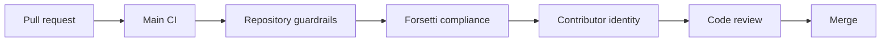

# GitHub Automation Workflows

Date: 2026-05-21
Project: Yggdrasil World Engine
Status: active automation governance baseline

## Purpose

This document describes the repository automation that validates specification
integrity, documentation hygiene, Forsetti alignment, wiki publication, and
contributor identity boundaries.

## Active Workflow Map

| Workflow | File | Responsibility |
|---|---|---|
| Main CI | `.github/workflows/main-ci.yml` | Runs the complete canonical check catalog and machine-readable artifact group. |
| YWE Repository Guardrails | `.github/workflows/ywe_repository_guardrails.yml` | Runs phase, attribution, and pull-request change-safety catalog groups. |
| Forsetti Compliance | `.github/workflows/forsetti-compliance.yml` | Runs the catalog governance group. |
| Branch Guard | `.github/workflows/branch-guard.yml` | Runs the catalog platform-boundary check. |
| Wiki Sync | `.github/workflows/wiki-sync.yml` | Publishes selected repository documentation into the GitHub wiki. |
| Version Baseline & Changelog | `.github/workflows/versioning.yml` | Manually updates synchronized baseline versions and the changelog; it does not publish a release. |
| Contributor Identity Gate | [`.github/workflows/contributor-identity-policy.yml`](../../.github/workflows/contributor-identity-policy.yml) | Blocks prohibited contributor identity strings in commit metadata. |
| Stale Issues | `.github/workflows/stale.yml` | Manages stale issue labeling and closure policy. |

## Local Script Map

| Script | Used By | Responsibility |
|---|---|---|
| `scripts/validate_repository.py` | All validation workflows | Canonical catalog-driven validation runner. |
| `data/validation/repository_checks.json` | All validation workflows | Stable check identifiers, groups, contexts, and roadmap ownership. |
| `scripts/run_checks.sh` | Local POSIX environments | Thin launcher for the canonical runner. |
| `scripts/check_json_integrity.py` | Repository guardrails | Parses and validates JSON artifacts. |
| `scripts/check_required_contracts.py` | Repository guardrails | Confirms required authority contracts remain present. |
| `scripts/check_phase_8_9_required_artifacts.py` | Repository guardrails | Confirms Phase 8-9 runtime foundation artifacts remain present. |
| `scripts/check_authority_stack.py` | Repository guardrails | Scans for source-truth and authority-stack drift. |
| `scripts/check_branch_reality_guardrail.py` | Repository guardrails | Protects branch-reality and base-ontology language. |
| `scripts/check_phase_9_schema_semantics.py` | Repository guardrails | Protects Phase 9 runtime cosmology schema semantics. |
| `scripts/check_phase_8_9_package_boundary.py` | Repository guardrails | Protects package-boundary scope for Phase 8-9 accepted artifacts. |
| `scripts/check_player_runtime_state.py` | Repository guardrails | Protects Phase 10 player-runtime state. |
| `scripts/check_worldstate_location_mutation.py` | Repository guardrails | Protects Phase 11 consequence and location mutation. |
| `scripts/check_quest_npc_lore_generation.py` | Repository guardrails | Protects Phase 12 quest, NPC, lore, myth, and social-distribution contracts. |
| `scripts/check_source_truth_alignment.py` | Repository guardrails | Protects source-truth and Twin Wolf alignment. |
| `scripts/check_ability_power_engine.py` | Repository guardrails | Protects Phase 14 Ability / Power Engine contracts, schemas, examples, and budgets. |
| `scripts/check_non_destructive_diff.py` | Repository guardrails | Blocks silent deletion or broad removal of accepted artifacts. |
| `scripts/github/Test-DocsAndGlossary.ps1` | Publication-readiness utility, PowerShell-capable environments | Checks markdown links, wiki-sync config, and glossary terms. |
| [`scripts/github/Test-ContributorIdentityPolicy.ps1`](../../scripts/github/Test-ContributorIdentityPolicy.ps1) | Contributor identity gate | Validates commit author, committer, and message identity strings. |

## Wiki Sync Behavior

The repository currently has two wiki publication mechanisms:

| Mechanism | Source | Behavior |
|---|---|---|
| GitHub Actions workflow | `.github/workflows/wiki-sync.yml` | Builds selected composite wiki pages and pushes them to the wiki repository on `main` pushes. |
| Config-driven sync script | `scripts/github/Sync-Wiki.ps1` with `.github/wiki-sync.json` | Copies configured source files to configured wiki destinations and builds a simple sidebar. |

The workflow path is the active hosted publication route. The config-driven
script remains useful as a local or future workflow implementation detail, but
the two mechanisms must stay synchronized when page names, source files, or
wiki navigation change.

Phase 14 ability validation is registered in the canonical check catalog and is
reached through the same runner locally and in hosted workflows.

## Review Gates

Every pull request should preserve these gates:

If any gate fails, inspect the workflow log, reproduce the failing command
locally when possible, and patch the smallest contract or documentation surface
that resolves the mismatch without weakening the guardrail.

## Throughput And Safety Limits

| Automation | Limit |
|---|---|
| Non-destructive package budget | Phase 12 and Phase 14 allow `0` deletions, `0` renames, `0` copies, and cap existing-file touches at `25`. |

## Operating Rules

- Automation validates repository truth; it does not invent canon.
- Wiki publication must preserve the current authority stack and accepted phase
  surfaces.
- Contributor identity checks are hard gates for protected branch hygiene.
- Non-destructive diff checks protect accepted package artifacts from silent
  removal or broad rewrites.
