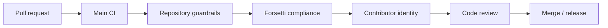

# GitHub Automation Workflows

Date: 2026-05-21
Project: Yggdrasil World Engine
Status: active automation governance baseline

## Purpose

This document describes the repository automation that validates release
readiness, documentation hygiene, Forsetti alignment, discussion policy, wiki
publication, and contributor identity boundaries.

## Active Workflow Map

| Workflow | File | Responsibility |
|---|---|---|
| Main CI | `.github/workflows/main-ci.yml` | Runs the primary validation suite and JSON lint checks. |
| YWE Repository Guardrails | `.github/workflows/ywe_repository_guardrails.yml` | Runs repository package checks, authority scans, phase guardrails, source-truth alignment, and non-destructive diff checks. |
| Forsetti Compliance | `.github/workflows/forsetti-compliance.yml` | Verifies Forsetti governance files, manifest templates, dependency boundaries, and independent-generator restrictions. |
| Branch Guard | `.github/workflows/branch-guard.yml` | Blocks engine-specific runtime code on the sealed specification branch. |
| Wiki Sync | `.github/workflows/wiki-sync.yml` | Publishes selected repository documentation into the GitHub wiki. |
| Versioning & Changelog | `.github/workflows/versioning.yml` | Updates `version.txt`, `CHANGELOG.md`, governance file versions, and release tags. |
| Discussion Agents | `.github/workflows/discussion-agents.yml` | Routes GitHub Discussion events to repository-grounded response handlers. |
| Discussion Topic Seeder | `.github/workflows/discussion-topic-seeder.yml` | Seeds discussion topics from repository truth on a schedule. |
| Discussion Moderation | `.github/workflows/discussion-moderation.yml` | Enforces the code of conduct for GitHub Discussions. |
| Contributor Identity Gate | [`.github/workflows/contributor-identity-policy.yml`](../../.github/workflows/contributor-identity-policy.yml) | Blocks prohibited contributor identity strings in commit metadata. |
| Stale Issues | `.github/workflows/stale.yml` | Manages stale issue labeling and closure policy. |

## Local Script Map

| Script | Used By | Responsibility |
|---|---|---|
| `scripts/run_checks.sh` | Main CI, Forsetti Compliance, repository guardrails | Authoritative POSIX validation suite. |
| `scripts/check_json_integrity.py` | Repository guardrails | Parses and validates JSON artifacts. |
| `scripts/check_required_contracts.py` | Repository guardrails | Confirms required authority contracts remain present. |
| `scripts/check_phase_8_9_required_artifacts.py` | Repository guardrails | Confirms Phase 8-9 runtime foundation artifacts remain present. |
| `scripts/check_authority_stack.py` | Repository guardrails | Scans for source-truth and authority-stack drift. |
| `scripts/check_branch_reality_guardrail.py` | Repository guardrails | Protects branch-reality and base-ontology language. |
| `scripts/check_phase_9_schema_semantics.py` | Repository guardrails | Protects Phase 9 runtime cosmology schema semantics. |
| `scripts/check_phase_8_9_package_boundary.py` | Repository guardrails | Protects package-boundary scope for Phase 8-9 accepted artifacts. |
| `scripts/check_player_runtime_state.py` | Repository guardrails | Protects Phase 10 player-runtime state. |
| `scripts/check_worldstate_location_mutation.py` | Repository guardrails | Protects Phase 11 consequence and location mutation. |
| `scripts/check_quest_npc_lore_generation.py` | Repository guardrails | Protects Phase 12 quest, NPC, lore, myth, and social-distribution contracts. |
| `scripts/check_source_truth_alignment.py` | Repository guardrails | Protects source-truth and Twin Wolf alignment. |
| `scripts/check_ability_power_engine.py` | Repository guardrails | Protects Phase 14 Ability / Power Engine contracts, schemas, examples, and budgets. |
| `scripts/check_non_destructive_diff.py` | Repository guardrails | Blocks silent deletion or broad removal of accepted artifacts. |
| `scripts/github/Test-DocsAndGlossary.ps1` | Release readiness, PowerShell-capable environments | Checks markdown links, wiki-sync config, and glossary terms. |
| [`scripts/github/Test-ContributorIdentityPolicy.ps1`](../../scripts/github/Test-ContributorIdentityPolicy.ps1) | Contributor identity gate | Validates commit author, committer, and message identity strings. |

## Wiki Sync Behavior

The repository currently has two wiki publication mechanisms:

| Mechanism | Source | Behavior |
|---|---|---|
| GitHub Actions workflow | `.github/workflows/wiki-sync.yml` | Builds selected composite wiki pages and pushes them to the wiki repository on `main` pushes. |
| Config-driven sync script | `scripts/github/Sync-Wiki.ps1` with `.github/wiki-sync.json` | Copies configured source files to configured wiki destinations and builds a simple sidebar. |

The workflow path is the active hosted publication route. The config-driven
script remains useful as a local or future workflow implementation detail, but
the two mechanisms must stay synchronized when page names, source files, or
wiki navigation change.

Phase 14 ability validation is reached through `bash scripts/run_checks.sh` in
the hosted guardrail workflow and through the same script in local validation.

## Release And Review Gates

Every pull request should preserve these gates:

If any gate fails, inspect the workflow log, reproduce the failing command
locally when possible, and patch the smallest contract or documentation surface
that resolves the mismatch without weakening the guardrail.

## Throughput And Safety Limits

| Automation | Limit |
|---|---|
| Discussion topic seeding | At most `3` new topics per run and `1` per discussion family. |
| Discussion response retrieval | At most `3` source matches with bounded excerpts. |
| Discussion moderation scan | At most `75` discussions and `40` comments per scheduled scan. |
| Non-destructive package budget | Phase 12 and Phase 14 allow `0` deletions, `0` renames, `0` copies, and cap existing-file touches at `25`. |

## Operating Rules

- Automation validates repository truth; it does not invent canon.
- Wiki publication must preserve the current authority stack and accepted phase
  surfaces.
- Discussion responses must be grounded in tracked repository sources.
- Contributor identity checks are hard gates for protected branch hygiene.
- Non-destructive diff checks protect accepted package artifacts from silent
  removal or broad rewrites.
