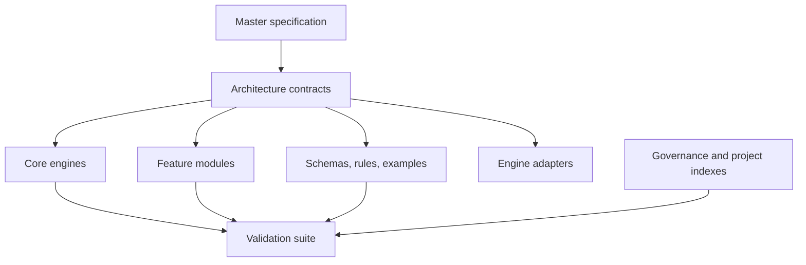

# Repository Map

This map describes the stable repository layout for Yggdrasil World Engine.

## Root Files

| Path | Purpose |
|---|---|
| `README.md` | Public project overview and validation guide |
| `CHANGELOG.md` | Release and change history |
| `CONTRIBUTING.md` | Contribution workflow |
| `guide.md` | Repository operating guide |
| `developer-guide.md` | Implementation and validation guide |
| `wiki.md` | Wiki routing index |
| `repository-contribution-policy.json` | Machine-readable contribution policy |
| `yggdrasil-instructions.json` | Machine-readable project instruction set |
| `missing_source_documents.md` | Root source inventory mirror |
| `SOURCE_AVAILABILITY_MANIFEST.md` | Source availability mirror for validation tooling |

## Directory Ownership

| Directory | Ownership |
|---|---|
| `docs/architecture/` | Canonical architecture contracts and integration maps |
| `docs/project/` | Stable project status, source inventory, and repository map |
| `docs/governance/` | Governance and GitHub workflow documentation |
| `docs/master_specification/` | Master specification |
| `core/` | Core engine interfaces and rules |
| `modules/` | Feature-module interfaces and rules |
| `data/schemas/` | JSON schema contracts |
| `data/validation/` | Validation contracts and check specifications |
| `examples/` | Contract examples and validation fixtures |
| `conformance/` | Evidence and conformance reports |
| `scripts/` | Local validation and repository maintenance tooling |
| `.github/` | Hosted validation workflows and wiki sync routing |
| `adapters/` | Host-engine adapter contracts |

## Runtime Boundary

Core and module contracts define code-agnostic YWE semantics. Host adapters may
materialize approved records, but they do not author ASH math, base ontology,
shared world truth, branch reality, player truth, worldstate truth, quest truth,
NPC truth, lore archive truth, myth truth, prophecy truth, ability truth, or wolf
canon.
